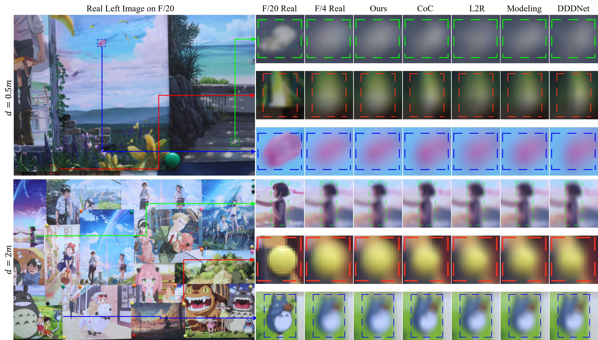
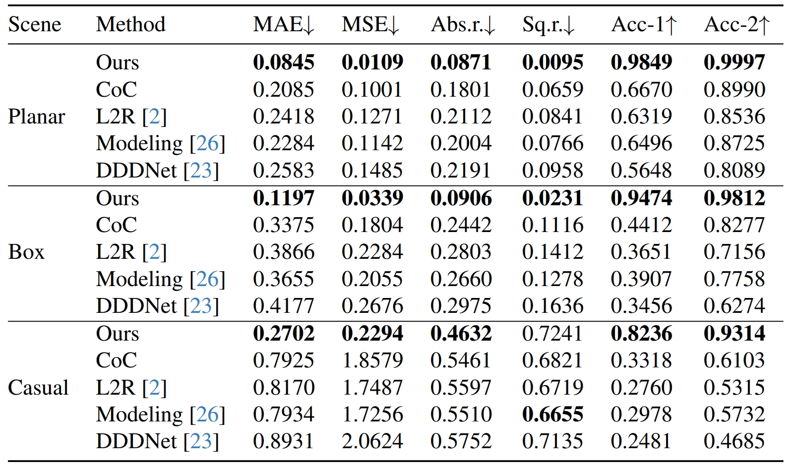

<div align="center">
  <h2><strong>Simulating Dual-Pixel Images From Ray Tracing For Depth Estimation</strong></h2>
  <p>
    <strong>Accepted by ICCV 2025</strong> 🎉 <br>
    <a href="https://github.com/LinYark" target="_blank" rel="noopener noreferrer">Fengchen He</a>, Dayang Zhao, Hao Xu, Tingwei Quan, Shaoqun Zeng <br>
    HUST, China
  </p>

  <p>
    <a href="https://arxiv.org/abs/2503.11213" target="_blank" rel="noopener noreferrer">
      📚 arXiv
    </a> &nbsp;&nbsp;|&nbsp;&nbsp;
    <a href="https://linyark.github.io/Sdirt/papers/Sdirt_main.pdf" target="_blank" rel="noopener noreferrer">
      📄 Paper
    </a> &nbsp;&nbsp;|&nbsp;&nbsp;
    <a href="https://linyark.github.io/Sdirt/papers/Sdirt_supp.pdf" target="_blank" rel="noopener noreferrer">
      🧾 Supp
    </a> &nbsp;&nbsp;|&nbsp;&nbsp;
    <!-- <a href="#" target="_blank" rel="noopener noreferrer">
      📦 Dataset
    </a> &nbsp;&nbsp;|&nbsp;&nbsp; -->
    <a href="https://linyark.github.io/Sdirt" target="_blank" rel="noopener noreferrer">
      🔗 Project
    </a>
  </p>
</div>


## ✍️ TL;DR
Dual-Pixel (DP) images are valuable for depth estimation, but real DP-depth paired datasets are scarce.  
**Sdirt** leverages **ray tracing** to simulate realistic DP images, effectively reducing the **domain gap** between synthetic and real data.

<div align="center">
  
</div>


## 🚀  How to Use the Code
To learn more usage about this codebase, kindly refer to [GET_START.md](./docs/GET_START.md).


## 🛠️ Code & Dataset Release Plan
- [x] Paper available on arXiv with citation examples
- [ ] Open-source Sdirt in stages:
  - [x] [Project pages](https://linyark.github.io/Sdirt)
  - [ ] Dataset
  - [ ] Full source code
- [ ] Full code will be released **after the paper is officially published**


## 📊 Results
#### Qualitative Results of Simulated DP PSFs (👇)
<p align="center">
  
</p>

#### Qualitative Results of Simulated DP Images (👇)
<p align="center">
  
</p>

####  Qualitative Results of Absolute Depth Estimation (👇)
<p align="center">
  
</p>

####  Quantitative Results of Absolute Depth Estimation (👇)
<p align="center">
  
</p>


## Citations
We appreciate a star ⭐ if you'd like to follow future updates.
If you find it useful, please consider citing our paper:
```bibtex
@article{he2025simulating,
  title={Simulating Dual-Pixel Images From Ray Tracing For Depth Estimation},
  author={He, Fengchen and Zhao, Dayang and Xu, Hao and Quan, Tingwei and Zeng, Shaoqun},
  journal={arXiv preprint arXiv:2503.11213},
  year={2025}
}
```

## Acknowledgments
This work was supported by National Natural Science Foundation of China (Grant No. 32471146) and the project N20240194.
The authors thank Echossom, Miya, and Xinge for valuable discussions and assistance.

---
🤔 Btw, I am seeking help from any engineer familiar with Dual/Quad-Pixel sensors. (⚡plz contact [me](https://github.com/LinYark), crying⚡).
<p align="right">
  <a href="https://github.com/LinYark/Sdirt">
    
  </a>
</p>
<!-- [](https://github.com/LinYark/Sdirt) -->