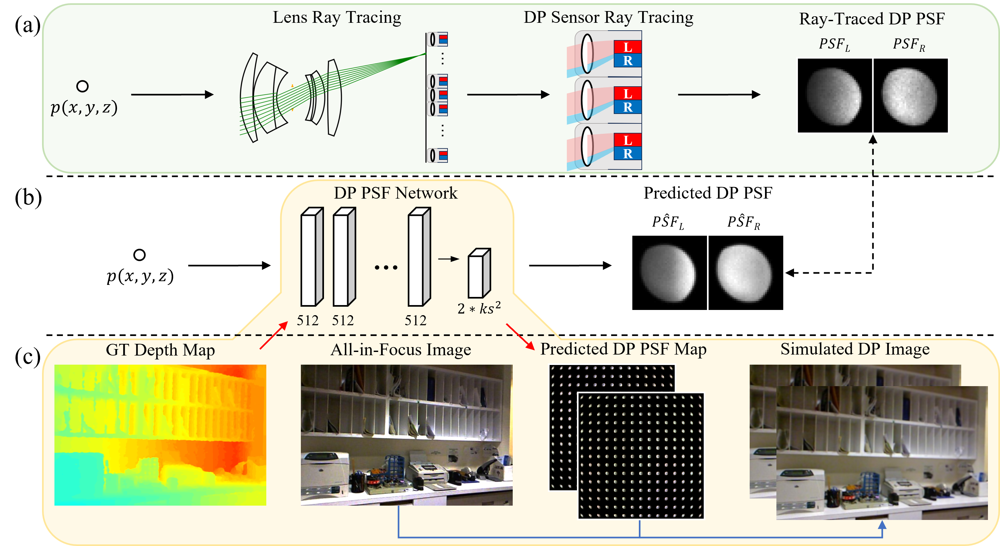
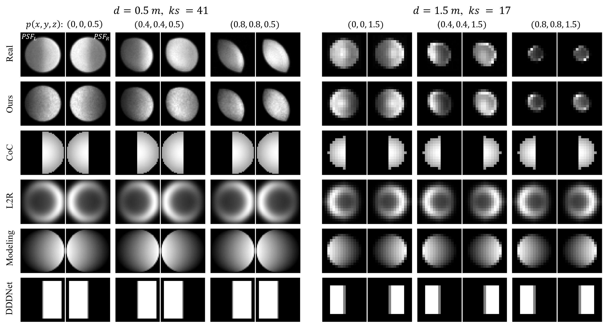

<div align="center">
  <h2><strong>Simulating Dual-Pixel Images From Ray Tracing For Depth Estimation</strong></h2>
  <p>
    <strong>Accepted by ICCV 2025</strong> 🎉 <br>
    <a href="https://github.com/LinYark" target="_blank" rel="noopener noreferrer">Fengchen He</a>, Dayang Zhao, Hao Xu, Tingwei Quan, Shaoqun Zeng <br>
    HUST, China
  </p>

  <p>
    <a href="https://arxiv.org/abs/2503.11213" target="_blank" rel="noopener noreferrer">
      📚 arXiv
    </a> &nbsp;&nbsp;|&nbsp;&nbsp;
    <a href="https://linyark.github.io/Sdirt/papers/Sdirt_main.pdf" target="_blank" rel="noopener noreferrer">
      📄 Paper
    </a> &nbsp;&nbsp;|&nbsp;&nbsp;
    <a href="https://linyark.github.io/Sdirt/papers/Sdirt_supp.pdf" target="_blank" rel="noopener noreferrer">
      🧾 Supp
    </a> &nbsp;&nbsp;|&nbsp;&nbsp;
    <!-- <a href="#" target="_blank" rel="noopener noreferrer">
      📦 Dataset
    </a> &nbsp;&nbsp;|&nbsp;&nbsp; -->
    <a href="https://linyark.github.io/Sdirt" target="_blank" rel="noopener noreferrer">
      🔗 Website
    </a>
  </p>
</div>


## ✍️ TL;DR
Dual-Pixel (DP) images are valuable for depth estimation, but real DP-depth paired datasets are scarce.  
**Sdirt** leverages **ray tracing** to simulate realistic DP images, effectively reducing the **domain gap** between synthetic and real data.

<div align="center">
  
</div>


## 📦 A New Test Set DP119
[Google Drive](https://drive.google.com/file/d/1uFppWgOoDpJxw5Np1ndr3PmYbZqatOe-/view?usp=sharing) | [Baidu Drive](https://pan.baidu.com/s/1R41pzEu01klKtvFDL1XeOA?pwd=echo)

We collected a real Dual-Pixel and depth paired test set with an open lens structure and fixed focus, featuring diverse real-world scenes, which are not available in any other existing dataset (202506).    
(a) planar scenes. (b) boxs scenes. (c) casual scenes.

<p align="center">
  
</p>

## 🚀  How to Use the Code
##### Prepare your python envs
```bash
# python == 3.9
# numpy == 1.26.0
# pytorch == 1.12.1
```

##### Train a Dual-Pixel PSFNet for a camera

```bash
# input: (x, y, z), output: PSF at (x, y, z) when the lens is focused to foc_dist
python 1_fit_psfnet.py
```

##### Simulate photos with the same aberration, defocus, and phase as capture
Sample data are provided for evaluation. Simulate F/4 imgs and depth est on samples.
```bash
python 2_dfdp_net.py
```

Download DP119 for full test set evaluation.
```bash
# 1. Download the DP119
# 2. Disable the code for "Only test on sample real_set of DP119"
# 3. ↓
python 2_dfdp_net.py
```

Train a Depth-from-Dual-Pixel network.
```bash
# 1. Download the training set
#    NYUv2: Available at https://github.com/JunjH/Revisiting_Single_Depth_Estimation
#    FlyingThings3D_FS: Available at https://github.com/albert100121/AiFDepthNet
# 2. Disable the code for "Only test on sample real_set of DP119"
# 3. Disable the code for "Only test on full real_set DP119"
# 4. ↓
python 2_dfdp_net.py
```


##### Try to reproduce?

All DfDP models share the same depth estimation network architecture, initialize from a common CoC pre-trained checkpoint, so plz train a CoC DfDP model first as your pre-trained checkpoint. 


## 📊 Results
#### Qualitative Results of Simulated DP PSFs (👇)
<p align="center">
  
</p>

#### Qualitative Results of Simulated DP Images (👇)
<p align="center">
  
</p>

####  Qualitative Results of Absolute Depth Estimation (👇)
<p align="center">
  
</p>

####  Quantitative Results of Absolute Depth Estimation (👇)
<p align="center">
  
</p>


## Citations
We appreciate a star ⭐ if you'd like to follow future updates.
If you find it useful, please consider citing our paper:
```bibtex
@article{he2025simulating,
  title={Simulating Dual-Pixel Images From Ray Tracing For Depth Estimation},
  author={He, Fengchen and Zhao, Dayang and Xu, Hao and Quan, Tingwei and Zeng, Shaoqun},
  journal={arXiv preprint arXiv:2503.11213},
  year={2025}
}
```

## Acknowledgments
This work was supported by National Natural Science Foundation of China (Grant No. 32471146) and the project N20240194. The authors thank Echossom, Miya, and [Xinge](https://singer-yang.github.io/) for valuable discussions and assistance.

---
## Lastly
If you are also interested in exploring structural parameters of dual-pixel sensors from other cameras, or in conducting further optical simulations on quad-pixel structures, you are always welcome to contact [me](https://github.com/LinYark).

🤔 Btw, I am seeking help from any engineer familiar with Dual/Quad-Pixel sensors. (⚡plz contact [me](https://github.com/LinYark), crying⚡).

<!-- <p align="right">
  <a href="https://github.com/LinYark/Sdirt">
    
  </a>
</p> -->
<!-- [](https://github.com/LinYark/Sdirt) -->